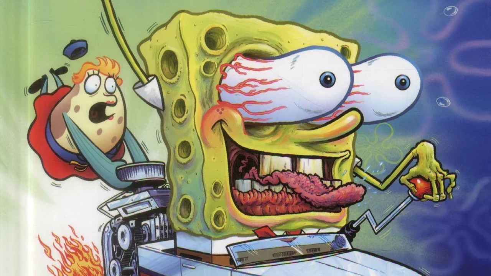

# Rodrigo CSE29 Page Lab 9

**This is a bolded text using two asterisks before and after the last word**\

*This is an italicized text using one asterisk before and after the last word*\

To **separate** sentences and place them on a new line, either use backslash right after the sentence ends, or press enter twice\

